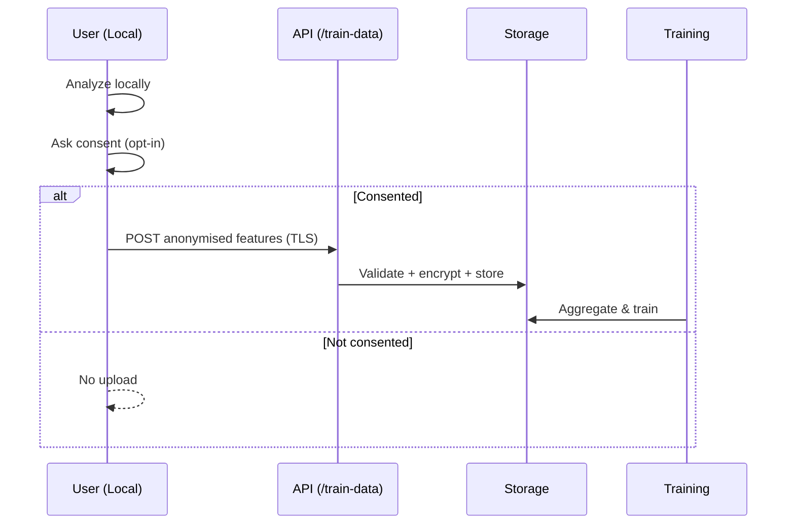

# Architecture

## Overview
The library is split into **core**, **providers**, **adapters**, and **API/CLI**.  
Providers implement small interfaces so stronger engines can be swapped in without changing user code.

```

User CSV/Adapters → Core (features) → Providers (forecast/optimize/anomaly) → Coach → Reports

````

## Component Diagram
```mermaid
flowchart LR
  A[Input: CSV / Adapter] --> F[Core: Features]
  F --> P1[Provider: Forecast]
  F --> P2[Provider: Anomaly]
  P1 --> O[Provider: Optimizer]
  F --> O
  O --> C[Coach: Actions]
  P2 --> C
  C --> R[Reports: JSON/MD]
````

## Provider Interfaces

* `BaseForecaster.fit(ts) / predict(horizon, freq)`
* `BaseOptimizer.schedule(forecast, tariff, cycles)`
* `BaseAnomalyDetector.detect(ts)`
* `BaseCO2Provider.intensity(series|date)`

Default open implementations:

* Prophet/ARIMA forecaster
* Tariff-window optimizer
* IsolationForest anomaly detector
* Static CO₂ intensity

## Private Providers (Optional)

Advanced providers can live in separate packages and be selected via a class path string, e.g.:

```
private_energy.providers.forecast.xgb_forecaster:PrivateForecaster
```

If not installed, the library falls back to defaults.

## Optional Data Contribution Flow

Local by default. If a user opts in, aggregated features are posted to `/train-data`.
No PII, encrypted in transit and at rest. See `PRIVACY.md`.

### Sequence Diagram

